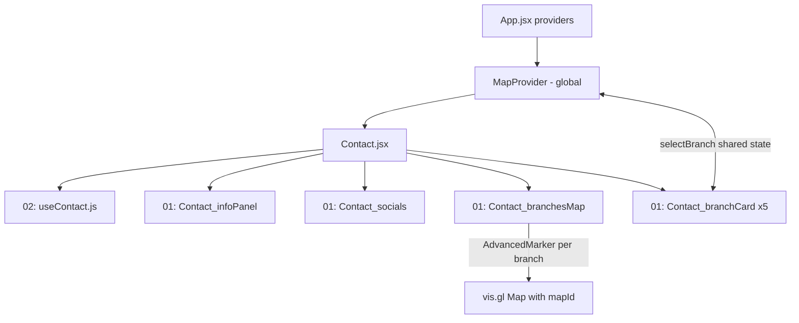

# Contact Page with Google Maps and Global MapContext

## Library choice (recommendation)

Use **`@vis.gl/react-google-maps` v1.9** - Google's officially endorsed React library. It gives us `APIProvider` (script loading), `Map`, `AdvancedMarker` + `Pin` (the modern marker; classic `google.maps.Marker` is deprecated), and `InfoWindow`, all as plain React components. Requires an API key and a **Map ID** (needed for AdvancedMarkers / cloud styling).

Secrets go in `frontEnd/.env.local` (gitignored):

- `VITE_GOOGLE_MAPS_API_KEY`
- `VITE_GOOGLE_MAPS_MAP_ID`

## 1. Global MapContext - [frontEnd/src/03_context/mapContext/MapContext.jsx](frontEnd/src/03_context/mapContext/MapContext.jsx)

Fill the two existing empty files, mirroring `LanguageContext` conventions (PropTypes, debug flag, named exports):

- `MapProvider` wraps children with vis.gl's `APIProvider` (key from `import.meta.env`) and exposes via context: `mapId`, `isMapReady` (via `APIProvider` load callbacks), Dubai defaults (`DUBAI_CENTER`, default zoom), `selectedBranchId` + `selectBranch()` (shared so the future order modal reuses the same state).
- `useMapContext.js` - guard hook identical in style to [useLanguageContext.js](frontEnd/src/03_context/languageContext/uselanguageContext.js).
- Register both in [\_context.index.js](frontEnd/src/03_context/_context.index.js) and mount `MapProvider` in [App.jsx](frontEnd/src/App.jsx) with the other providers.

Trade-off, flagged: mounting `APIProvider` globally loads the Maps JS script on every page. Since both Contact and the Menu's order modal will need it, this is acceptable and simplest; if it ever bothers us we can gate the script load later.

## 2. Real data - fill the const files from your Excel

- [BRANCHES.js](frontEnd/src/05_pages/public/contact/04_contact_const/BRANCHES.js): 5 branches (Arjan, Dubai Marina, BB SOL Avenue, BB Cuisinette, DSO) with `{en, ru, ar}` localized names, address, `googleMapsLink`, real coordinates, timing (24/7 flags; SOL and DSO 07:00–23:00), and an `aggregators` array - Talabat links filled where you provided them, the other aggregators (Careem, Deliveroo, Noon, Keeta) listed with logos but `link: null` until you provide them (cards render them disabled/hidden for now).
- [CONTACT_INFO.js](frontEnd/src/05_pages/public/contact/04_contact_const/CONTACT_INFO.js): phone `+971 52 102 5674` (`tel:`), WhatsApp (`wa.me` link, `WhatsApp_Logo`), email `info@vkusno.ae` (`mailto:`).
- [SOCIALS.js](frontEnd/src/05_pages/public/contact/04_contact_const/SOCIALS.js): Instagram + LinkedIn with your real URLs and logos from `_socialLogos.index.js`.

## 3. Contact page - mirror the menu page architecture

New files, one CSS per component in `00_contact_styles`:

- `Contact_infoPanel.jsx` - phone / WhatsApp / email rows with icons and working links.
- `Contact_socials.jsx` - Instagram / LinkedIn logo links.
- `Contact_branchesMap.jsx` - vis.gl `Map` centered on Dubai with 5 `AdvancedMarker` pins (brand-colored `Pin`); clicking a pin opens an `InfoWindow` with name, hours, and a "Directions" link (your `maps.app.goo.gl` URLs); selecting a branch card pans to its pin. Small fallback UI when the API key is missing or fails to load.
- `Contact_branchCard.jsx` - name, address, open hours (24/7 badge or times), aggregator logo links (only ones with URLs are clickable).
- `useContact.js` - reads `useMapContext` selection + `useTranslation("Contact")`.
- Rewrite [Contact.jsx](frontEnd/src/05_pages/public/contact/Contact.jsx) to compose these; fill the stub `Contact.json` locales (en/ru/ar) with all labels.

## 4. Google Cloud console - guide I will give you

A numbered walkthrough (delivered as chat instructions when we implement, so you can follow along):

1. Create/select a project at console.cloud.google.com; enable billing (required - new Essentials tier gives 10,000 free map loads/month for Maps JavaScript API).
2. Enable **Maps JavaScript API** only (that is all this feature needs).
3. Create an API key; restrict it: Application restriction = HTTP referrers (`localhost:5173/*`, `vkusno.ae/*`, `www.vkusno.ae/*`), API restriction = Maps JavaScript API only.
4. Create a **Map ID** (Google Maps Platform > Map Management) of type JavaScript/Vector - required for AdvancedMarkers, and lets you style the map to match the brand later.
5. Put both values into `frontEnd/.env.local`; verify `.env.local` is gitignored.

## Assumptions to confirm

- Branch display names get real ru/ar translations (I will draft them; you can correct).
- Layout: contact info + socials at top, map below, branch cards under the map (mobile-first, 2-column desktop where sensible).
